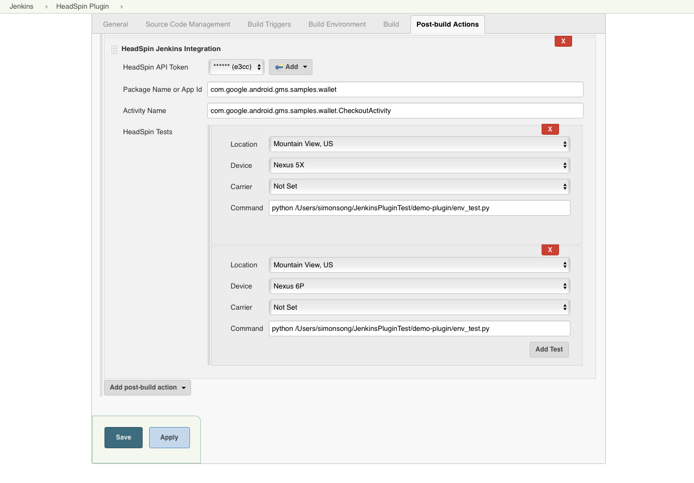
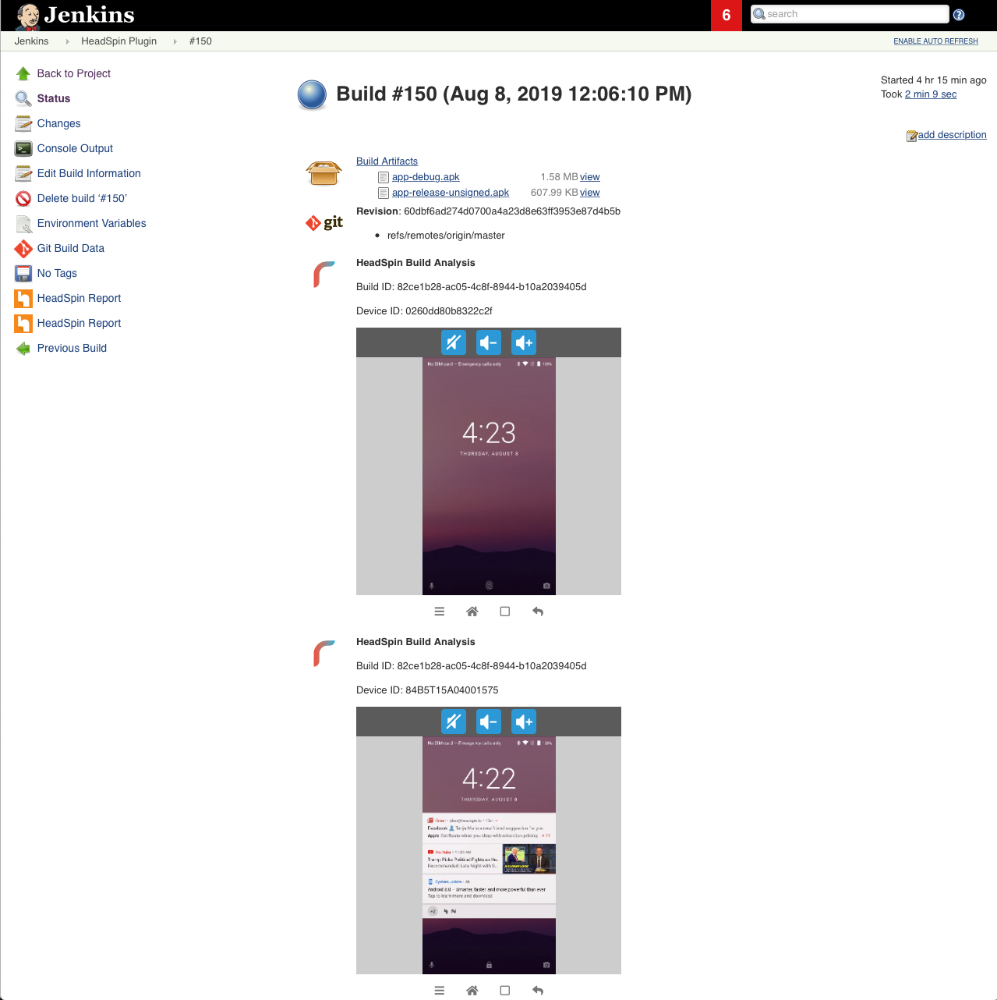
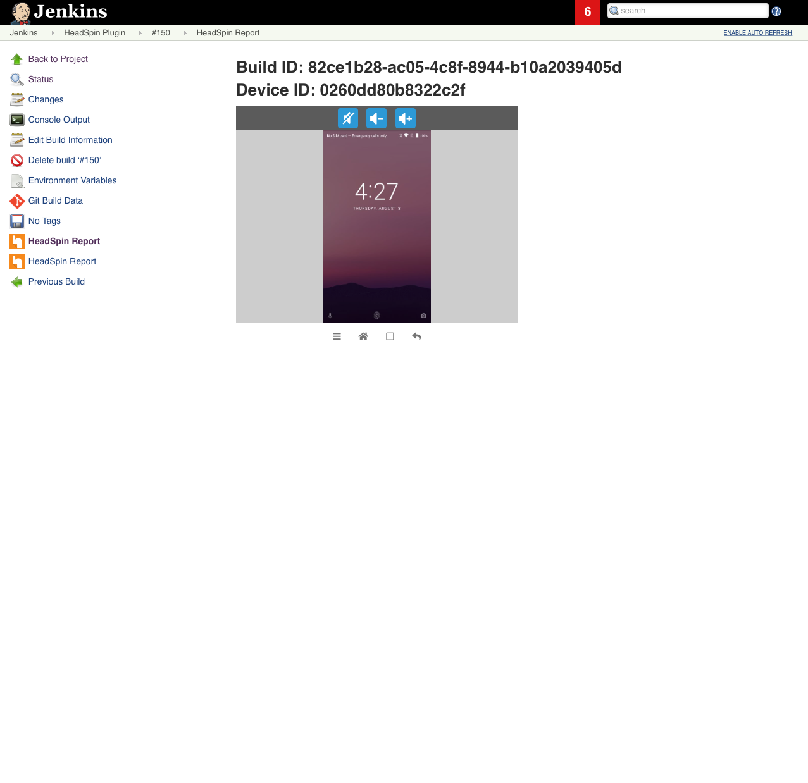

# Jenkins Integration

HeadSpin provides a plugin to Jenkins that does a deep integration of the HeadSpin session with the Jenkins concept of build. Using the HeadSpin plugin, each session is tagged with the build_id. This allows viewing all devices in use during a build, as well as end of build statistics based on the HeadSpin performance data. This document will explain how to configure and use the plugin.


## Installation

The HeadSpin plugin is hosted at [https://plugins.jenkins.io/headspin](https://plugins.jenkins.io/headspin) as well as the Jenkins Maven reposity under `io.jenkins.plugins:headspin`.

1. Go to `Manage Jenkins` > `Manage Plugins`.
2. Search for `HeadSpin` on `Available` tab.
3. Check the `Install` box and click the `Install without restart` or `Download now and install after restart` button.


## Set up

1. Create a Freestyle project.
2. Add `Archive the artifacts` on `Post-Build Actions`
3. Enter the file path. (The base directory is the workspace).

   For example:
   ```
   **/my-app.apk
   ```
4. Add `HeadSpin Jenkins Plugin` on `Post-Build Actions`.
5. Add HeadSpin API Token.
6. Enter Package Name for Android app or App Id for IOS app.
7. Enter Activity Name of the app where automation tests will start from.
8. Add HeadSpin Tests with selectors that choose a device and commands that run automation scripts.

   For example:
   

9. Save.


## Post-Build

### Summary
Summary page shows device views of running tests.




### Analysis
Analysis page ("HeadSpin Report") gives useful information about performance of your app.


